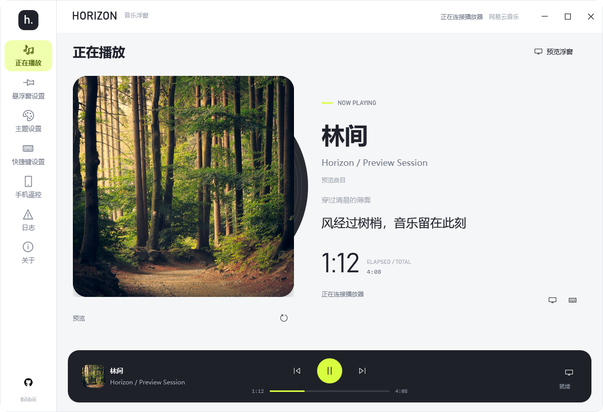
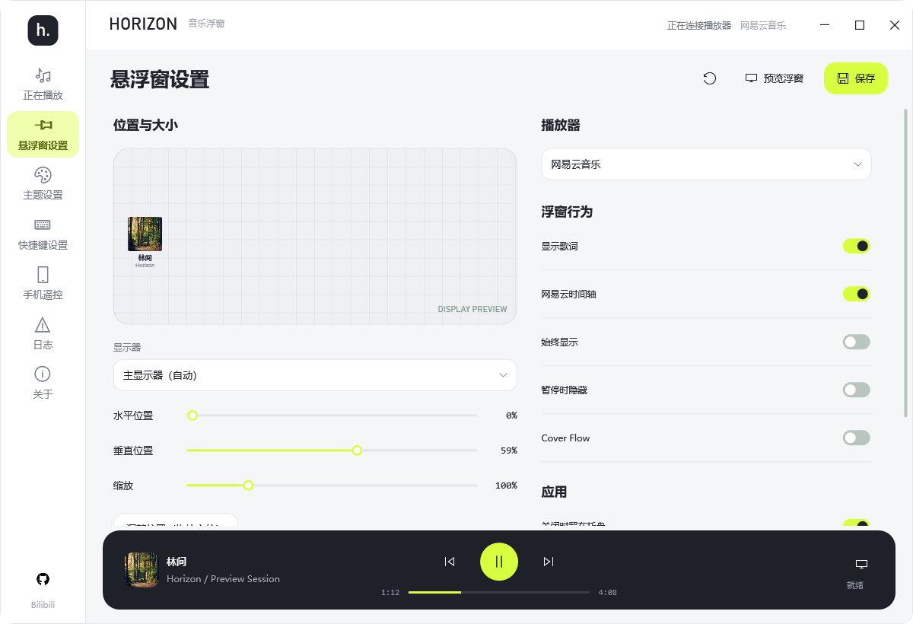
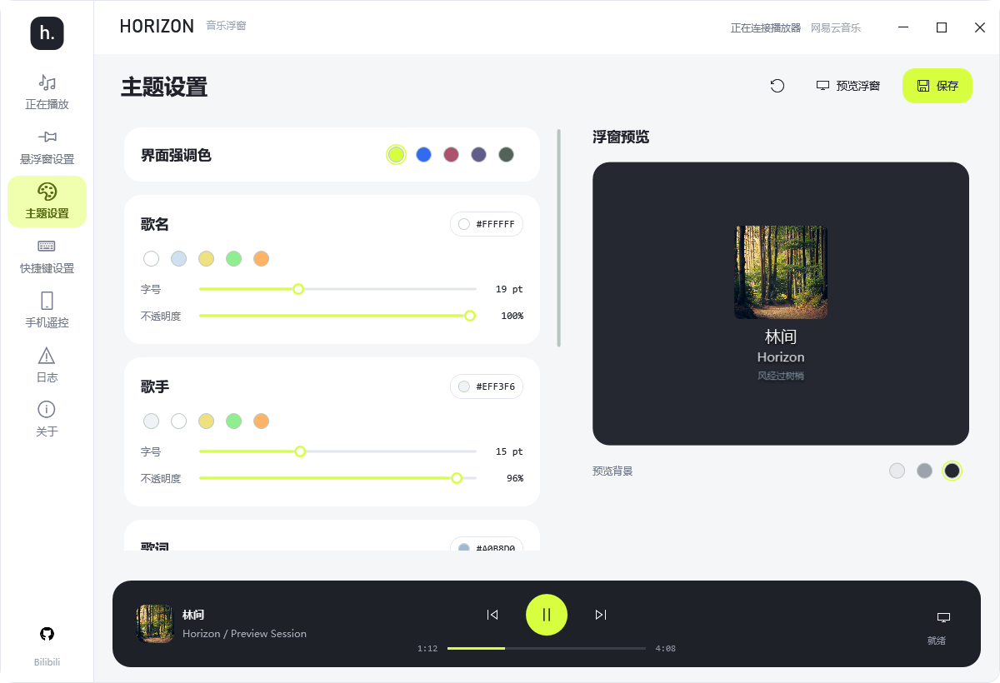

# HORIZON · 网易云悬浮窗

Windows 游戏音乐悬浮窗：在游戏画面上显示封面、歌名、歌手和同步歌词，用键盘、手柄或方向盘切歌。支持网易云音乐和提供系统媒体会话（SMTC）的播放器。

当前 `main` 已包含新版桌面界面、设置预览、多显示器定位和悬浮窗渲染修复。程序版本号仍为 `3.1.1`；本仓库尚未发布包含本次改版的安装包。要体验当前代码，请参照下方的[开发运行](#开发运行)或[自行打包](#自行打包)。

## 界面预览



| 悬浮窗设置：选择显示器、调整位置和大小 | 主题设置：颜色、字号与浮窗预览 |
| --- | --- |
|  |  |

<details>
<summary>查看 Cover Flow 悬浮窗效果</summary>


</details>

截图使用演示曲目和[预览素材](Assets/Artwork/README.md)；实际封面由所选播放器提供。

## 功能

- **透明悬浮窗**：点击穿透、置顶、不抢焦点；支持常驻、暂停时隐藏和 Cover Flow 效果
- **新版桌面界面**：正在播放页显示封面、播放进度、歌词和控制按钮，底部迷你播放器可跨页面操作
- **双数据源**：
  - **网易云专用渠道（默认）**：专门给网易云音乐使用
  - **SMTC 系统媒体会话**：用于 QQ 音乐、Apple Music、酷狗等提供系统时间轴的播放器
- **网易云封面适配**：优先从网易云本地播放数据定位当前歌曲，再从网易云官方接口获取并缓存封面
- **主题与文字自定义**：界面强调色，以及歌名、歌手、歌词的颜色、字号和不透明度；设置页可预览浮窗
- **切歌过渡**：常驻模式下交叉淡入淡出，不中断显示
- **键盘快捷键映射**：自定义应用快捷键 -> 转发网易云快捷键
- **手柄 / 方向盘外设快捷键**：支持组合键（如 `LB+Left`、`L1+Left` 或 `Button1+Button2`），独立开关
- **悬浮窗定位**：选择目标显示器，用滑块或直接拖拽调整位置，设置缩放并保存
- **设置持久化**：保存在 `%LOCALAPPDATA%\HorizonRadioOverlay\overlay-settings.json`
- **托盘最小化**：关闭时最小化到系统托盘，双击恢复
- **开机自启**：注册表方式，`--autostart` 最小化启动
- **检查更新**：自动检测上游 GitHub Releases 新版本
- **手机遥控**：同一局域网内通过手机网页控制播放和悬浮窗
- **实时歌词**：
  - `网易云窗口标题`：可选只读内存时间轴（实验功能）同步 seek；不可用或关闭时自动退回本地计时
  - `SMTC`：按系统媒体会话提供的歌名 / 歌手 / 时间轴进行查词与同步
- **后台播放快照**：播放器读取与界面刷新解耦，连续失败自动降级和重试

## 获取程序

本仓库目前没有对应新版界面的 Release。可从本仓库 `main` 分支自行构建；[上游 Releases](https://github.com/xw66/Cloud-Music-overlay-for-Forza-Horizon/releases) 提供的是上游已发布版本，不包含这里展示的本次界面改版。项目历史更新见 [CHANGELOG.md](CHANGELOG.md)。

构建时可选择三个架构：
- `win-x64`：绝大多数 PC 选择此版本
- `win-x86`：32 位系统
- `win-arm64`：ARM 设备（如 Surface Pro X）

> 网易云只读内存时间轴仅在 64 位进程中启用；`win-x86` 会自动使用本地歌词计时。

下方打包命令生成**自包含单文件版**，运行时无需另装 .NET。

### 运行方法

自行打包后双击 `HorizonRadioOverlay.exe`。如果 Windows 标记了下载文件，可在文件“属性”中勾选“解除锁定”；遇到 SmartScreen 提示时，请先核对文件来源，再选择是否继续运行。

## 运行环境

- Windows 10 1809（10.0.17763）及以上 / Windows 11
- 网易云音乐桌面版（仅网易云专用渠道需要，进程名：`cloudmusic`）
- （手柄功能）Xbox 兼容手柄或 Sony DualSense（DS5）；方向盘需支持 HID/DirectInput

> 说明 1：`SMTC` 模式依赖较新的 Windows 媒体会话能力。低于 Windows 10 1809 的环境会自动回退为网易云窗口标题模式。
>
> 说明 2：两个渠道是完全分开的业务：
> - **网易云窗口标题**：只给网易云使用，专门适配网易云封面、快捷键转发和歌词显示
> - **SMTC**：只对接 Windows `SMTC` 媒体会话，不针对某个播放器单独做业务适配

## 使用说明

### 第一步：使用网易云时设置快捷键

在网易云音乐中设置全局快捷键（如 `Ctrl+Alt+Left` 上一首、`Ctrl+Alt+Right` 下一首、`Ctrl+Alt+P` 播放/暂停）。只使用 SMTC 播放器时可跳过此步。

### 第二步：选择播放器并设置浮窗

- 在**悬浮窗设置**中选择“网易云音乐”或“系统媒体（SMTC）”，并选定显示器、位置、缩放和显示行为。也可点击“调整位置”，直接拖拽浮窗。
- 在**主题设置**中调整界面强调色和浮窗文字的颜色、字号、不透明度，右侧可即时预览。
- 使用网易云时，在**快捷键设置**中左侧填写游戏内按键，右侧填写网易云快捷键；手柄和方向盘按键可在对应区域启用。
- 点击页面右上角的“保存”以持久化设置。
- **歌词说明**：
  - `网易云窗口标题`：默认启用只读内存时间轴实验功能，可跟随 seek；读取失败时自动降级为本地计时，可在设置中关闭
  - `SMTC`：歌词滚动同步依赖 `SMTC` 时间轴

### 第三步：启动游戏

悬浮窗会在歌曲切换时自动弹出，默认 5 秒后淡出。勾选“始终显示”可保持常驻。DirectX 独占全屏游戏可能无法显示普通桌面悬浮窗，建议使用无边框窗口模式。

### 直播软件捕获悬浮窗

悬浮窗可作为独立窗口源捕获，无需录制整个桌面。以 OBS Studio 为例：

1. 在“来源”中添加“窗口采集”。
2. 窗口选择 `[HorizonRadioOverlay.exe]: [直播源] 网易云悬浮窗`，不要选择主页面“网易云悬浮窗”。
3. 捕获方式选择“Windows 10（1903 及以上）”或“自动”，不要使用旧版 BitBlt。
4. 窗口匹配优先级选择“窗口标题必须匹配”，开启“客户端区域”，关闭“捕获光标”。

这样会保留悬浮窗的透明背景、阴影、Cover Flow 和淡入淡出效果，其他桌面窗口不会进入画面。直播源窗口会一直供 OBS 绑定，悬浮窗淡出时来源只会变透明，不会回退捕获主页面。

## 快捷键说明

| 类型 | 示例 | 说明 |
|------|------|------|
| 键盘单键 | `L` | 单个字母或符号键 |
| 键盘组合 | `Ctrl+Shift+Left` | 修饰键 + 按键 |
| 手柄组合 | `LB+Left` / `L1+Left` | 按键用 `+` 连接 |
| 手柄特殊 | `LT+RT+Y` / `L2+R2+Triangle` | 支持 Xbox 与 DS5 按键名 |
| 方向盘外设 | `Button1+Button2` | 支持 HID/DirectInput 设备前 16 个物理按钮 |

## 开发运行

需要 Windows 和 .NET 10 SDK。在仓库根目录运行：

```powershell
.\dotnet10.cmd run
```

运行测试：

```powershell
.\dotnet10.cmd test tests\HorizonRadioOverlay.Tests\HorizonRadioOverlay.Tests.csproj -c Release
```

## 自行打包

```powershell
.\dotnet10.cmd publish -c Release -r win-x64 --self-contained true -p:PublishSingleFile=true -p:DebugSymbols=false -p:DebugType=None -o .\publish\HorizonRadioOverlay_main_win-x64
```

生成的程序位于 `publish\HorizonRadioOverlay_main_win-x64\HorizonRadioOverlay.exe`。如需其他架构，把命令中的 `win-x64` 改为 `win-x86` 或 `win-arm64`。

## 常见问题

**保存后不生效？**  
确认状态栏提示“已保存并应用”。若提示注册失败，说明应用快捷键被其他程序占用，换一组即可。

**悬浮窗不显示？**  
确认当前所选渠道与播放器匹配：
- **网易云窗口标题**：确认网易云正在播放歌曲，且进程名为 `cloudmusic`
- **SMTC**：确认当前播放器已开始播放，并且系统能读到媒体会话

**手柄或方向盘外设不能用？**  
确认设备已通过 USB 或蓝牙连接，“启用手柄 / 方向盘外设”已勾选并保存。方向盘按钮通常会显示为 `Button1` 到 `Button16`。

**悬浮窗位置/颜色不生效？**  
点击“保存”按钮持久化设置，或勾选对应选项即时生效。

**为什么有些歌词不显示？**  
- `网易云窗口标题`：会优先使用网易云本地识别到的 `songId` 取词；如果当前歌曲本身无歌词，或标题 / 本地数据未能稳定对应到正确歌曲，仍可能出现无歌词。
- `SMTC`：歌词依赖播放器提供的 `歌名 / 歌手 / 时间轴`。如果播放器元数据不完整、时间轴异常，或外部歌词源未命中，也可能出现少量歌曲无歌词。

**网易云歌词为什么显示“已降级”？**

只读内存时间轴尚未适配当前网易云版本，或连续读取失败。程序会自动保留歌词并改用本地计时，不会修改网易云进程；也可以在“悬浮窗设置”中关闭该实验功能。

**为什么有些游戏里悬浮窗还是可能被盖住？**  
当前版本已经加强了顶层保持策略，对大多数窗口化全屏、无边框全屏游戏会更稳定；但 DirectX 独占全屏游戏不支持普通桌面悬浮窗置顶。此类游戏会绕过桌面窗口合成，Windows 不允许普通 WPF/Win32 透明窗口覆盖在其画面上方。建议改用窗口化、无边框全屏、窗口化全屏模式，或使用 OBS 等直播软件捕获悬浮窗窗口源。

## 技术栈

- .NET 10.0 WPF
- SMTC（Windows.Media.Control）
- XInput + Windows.Gaming.Input（Xbox / DS5 手柄支持）
- Win32 API（全局热键、窗口枚举、快捷键转发）

## 许可证

MIT


